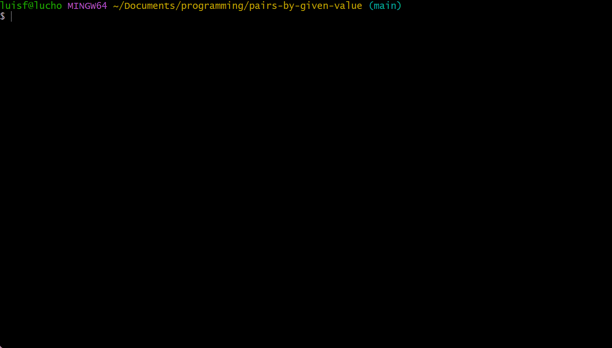

# Get pairs by given number

Welcome to the project! This README will guide you through setting up and running the project on your local machine. The project is a basic CLI(command line interface) tool which returns the list of pairs that sum specific value. The main algorithm located in `src/utils/getPairsByGivenNumber.js`, takes an array of numbers and a given number(all numbers must be lower than MAX_SAFE_INTEGER(9007199254740991) and grater than MIN_SAFE_INTEGER(-9007199254740991) values in JavaScript) to calculate the pairs that sum the given value. The time complexity of the algorithm is O(n).

## 📑 Table of Contents

- [Prerequisites](#prerequisites)
- [Installation](#installation)
- [Run the project](#run-the-project)
- [Run tests](#run-tests)

## Prerequisites

Before you begin, ensure you have met the following requirements:

- [Node.js](https://nodejs.org/) (version 18.16.1 or greater)
- [npm](https://www.npmjs.com/)

## Installation

1. Clone this repository using any shell:

```bash
git clone https://github.com/luisfernandocruces/pairs-by-given-value.git
cd pairs-by-given-value
```

2. Install dependencies:

```bash
npm install
```

## Run the project

To start the project:

```bash
npm start
```

Then, you can type the list of numbers and a given number to see all pairs that sum that value. Watch the example below:



## Run tests

```bash
npm test
```
